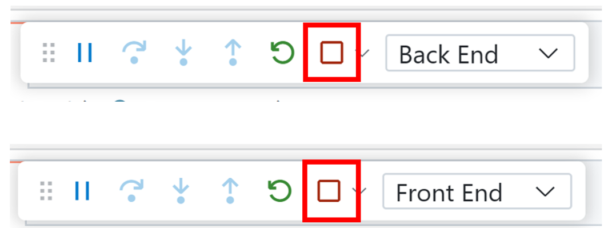

# Adanomad Resume Analyzer Challenge

I wrote the frontend page on the GitHub .NET Codespace.

This repo originally built a Weather API using Minimal APIs, opens Swagger so you can call and test the API, and displays the data in a web application using Blazor with .NET 8.

I directly edited the frontend razor page to accomplish resume analysis.

## Overview

This app takes in resume information, and generates both a word cloud of the most frequently mentioned words and the top 5 most frequently mentioned technical skills.

### Run Options

or go to Code -> CodeSpaces and click on the scaling halibut codespace to open in the browser.

You can also run this repository locally by following these instructions: 
1. Clone the repo to your local machine `git clone https://github.com/charlieliu2001/dotnet-codespaces-ResumeAnalyzer.git`
1. Open repo in VS Code

## Getting started

1. **📤 One-click setup**: [Open a new Codespace](https://codespaces.new/github/dotnet-codespaces), giving you a fully configured cloud developer environment.
2. **▶️ Run all, one-click again**: Use VS Code's built-in *Run* command and open the forwarded ports *8080* and *8081* in your browser. 

3. Go to ports and click on the globe to open the front end.

4. The Blazor web app should now be open on your browser. 

5. To stop running, return to VS Code, and click Stop twice in the debug toolbar. 

## Usage

1. Enter in the resume information.

2. Press submit and see the magic happen.

3. Click the Edit Information button to edit the provided information if needed, and resubmit.

