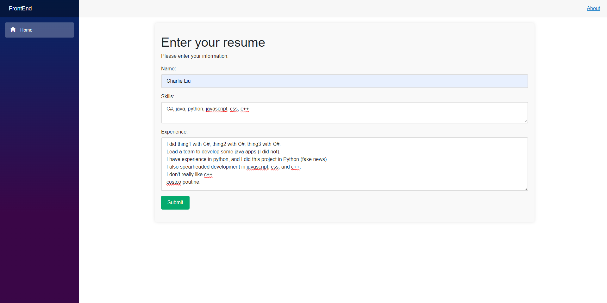

# Adanomad Resume Analyzer Challenge

I wrote the frontend page on the GitHub .NET Codespace with razor.

## Overview

This app takes in resume information, and uses the D3.js library to generate both a word cloud of the most frequently mentioned words and the top 5 most frequently mentioned technical skills.
Because this is just the front end, the data doesn't actually get sent to the backend for any further processing. Everything is done on the razor page with html, css, and javascript.

### Run Options

Go to Code -> CodeSpaces and click on 'Create codespace on main' to open in the browser.

If the created codespace is stuck loading, close the tab and try to open it again. This time, you should see the codespace you just created listed under 'CodeSpaces'. Click on it.

## Getting started

1. **📤 One-click setup**: opening the CodeSpace gives you a fully configured cloud developer environment.
2. **▶️ Run all, one-click again**: Use VS Code's built-in *Run* command and open the forwarded ports *8080* and *8081* in your browser. 

3. If it doesn't open automatically, go to ports and click on the globe to open the front end.

4. The Blazor web app should now be open on your browser. 

5. To stop running, return to VS Code, and click Stop twice in the debug toolbar. 

## Usage

1. Enter in the resume information.

2. Press submit and see the magic happen.

3. Click the Edit Information button to edit the provided information if needed, and resubmit.

## Error checking

1. Checks if the name is empty or has special characters other than apostrophes ('), and hyphens (-), which means it's most likely wrong.

2. Checks if there aren't any listed, and if the ones listed are short enough (less than 20 characters). Otherwise it's most likely wrong.

3. Soft check - if there aren't any of the listed skills mentioned in the experience, let the user know, but still continue with the analysis.

